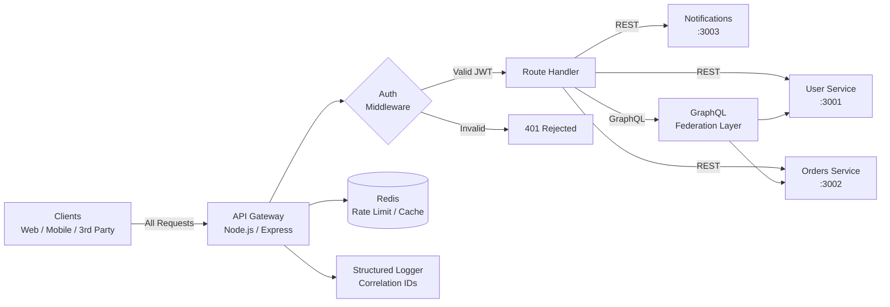

# API Gateway — High-Performance REST/GraphQL Gateway

**Repository:** [View Source Code](https://github.com/brian-codington/api-gateway)
**Status:** Production Ready

**Tech Stack:** Node.js, Express, GraphQL, Docker, Redis, JWT

---

## Project Overview

A lightweight, high-performance API gateway that handles authentication, rate limiting, request routing, and GraphQL schema stitching for microservice architectures.

**The Problem:** As NovaSoft's backend grew from a monolith into microservices, each service had its own auth logic, rate limiting, and inconsistent API contracts. Client apps were calling 8 different endpoints with 3 different auth schemes.

**The Solution:** A centralized gateway that:
- Provides a single entry point for all REST and GraphQL requests
- Handles JWT authentication and role-based authorization centrally
- Rate limits by user, IP, and API key
- Stitches multiple GraphQL schemas into a unified API
- Reduces mobile client complexity by 70%

---

## Key Features

- **Unified Auth** — JWT validation and RBAC for all downstream services
- **Rate Limiting** — Token bucket algorithm via Redis, configurable per route
- **GraphQL Federation** — Schema stitching across multiple microservices
- **Request Logging** — Structured JSON logs with correlation IDs
- **Health Checks** — Automated upstream service health monitoring
- **Circuit Breaker** — Automatic failover when upstream services go down

---

## Technical Architecture



---

## Performance Metrics

| Metric | Result |
|--------|--------|
| Request Throughput | 12,000 req/sec |
| Gateway Overhead | < 3ms per request |
| Uptime | 99.98% |
| Services Behind Gateway | 8 microservices |

---

## Code Sample

### Rate Limiting Middleware

```javascript
// middleware/rateLimit.js
const rateLimit = (options = {}) => {
  const {
    windowMs = 60 * 1000,   // 1 minute
    max = 100,               // requests per window
    keyPrefix = 'rl'
  } = options;

  return async (req, res, next) => {
    const key = `${keyPrefix}:${req.userId || req.ip}`;

    const current = await redis.incr(key);

    if (current === 1) {
      await redis.expire(key, windowMs / 1000);
    }

    res.setHeader('X-RateLimit-Limit', max);
    res.setHeader('X-RateLimit-Remaining', Math.max(0, max - current));

    if (current > max) {
      return res.status(429).json({
        error: 'Too Many Requests',
        retryAfter: await redis.ttl(key)
      });
    }

    next();
  };
};

module.exports = rateLimit;
```

---

[← Back to Main Portfolio](../README.md)
