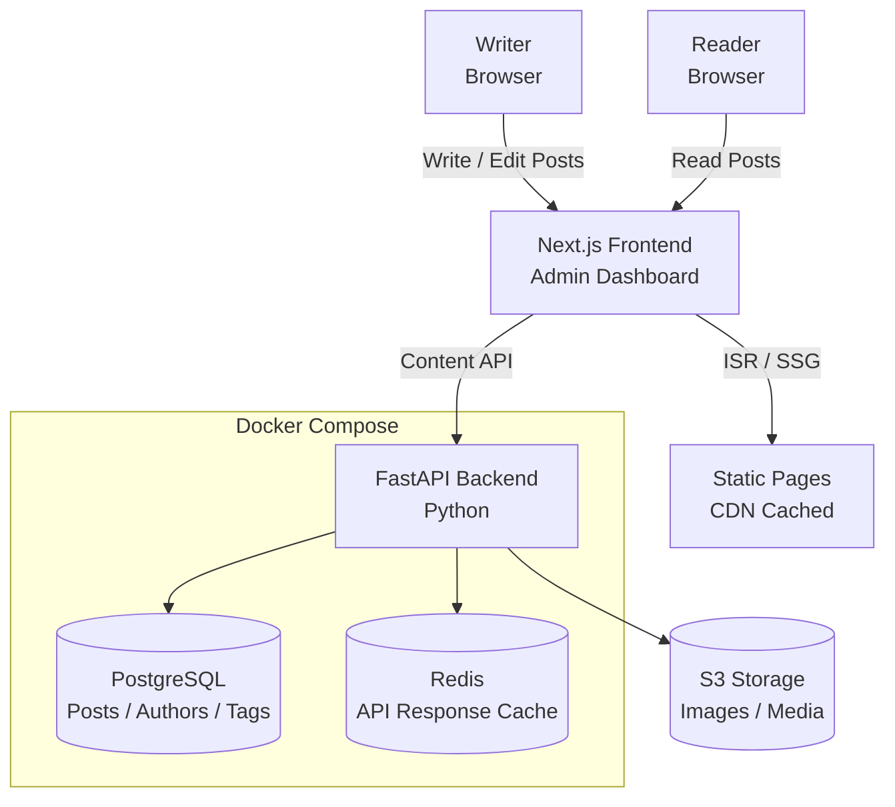

# OpenBlog — Headless CMS & Blogging Platform

**Repository:** [View Source Code](https://github.com/brian-codington/openblog)
**Live Demo:** [Try It Out](https://demo.openblog.dev)
**Status:** Production Ready

**Tech Stack:** Next.js, FastAPI, PostgreSQL, S3, TipTap, Docker

---

## Project Overview

A headless CMS and blogging platform built for developers and technical writers. Markdown-first, API-driven, and deployable anywhere. The writing experience is clean — the content API is flexible enough to power any frontend.

**The Problem:** WordPress is too heavy. Ghost is great but expensive to host. Most headless CMS options require vendor lock-in or complex setup for a simple technical blog.

**The Solution:** A self-hostable, open source platform that:
- Stores content as Markdown in PostgreSQL with a clean REST API
- Ships a beautiful Next.js frontend out of the box
- Supports code syntax highlighting, MDX components, and LaTeX
- Handles image uploads to S3-compatible storage
- Exports content to standard Markdown with no lock-in

---

## Key Features

- **Markdown-First Editor** — TipTap rich text editor with raw Markdown toggle
- **REST Content API** — Full CRUD API for posts, tags, authors, and media
- **Next.js Frontend** — ISR (Incremental Static Regeneration) for fast page loads
- **Code Highlighting** — Syntax highlighting via Shiki for 100+ languages
- **MDX Support** — Embed React components directly in posts
- **S3 Media Storage** — Image uploads to any S3-compatible provider
- **RSS + Sitemap** — Auto-generated RSS feed and XML sitemap

---

## Technical Architecture



---

## Performance Metrics

| Metric | Result |
|--------|--------|
| Lighthouse Performance Score | 97/100 |
| Time to First Byte (TTFB) | < 80ms (CDN cached) |
| API Response Time (p95) | < 120ms |
| GitHub Stars | 320+ |

---

## Code Sample

### Post API Endpoint (FastAPI)

```python
# api/routes/posts.py
from fastapi import APIRouter, Depends, HTTPException, Query
from sqlalchemy.orm import Session
from typing import Optional
from db import get_db
from models import Post, Tag
from schemas import PostCreate, PostResponse
from auth import get_current_user

router = APIRouter(prefix="/api/posts", tags=["posts"])

@router.get("/", response_model=list[PostResponse])
async def list_posts(
    page: int = Query(1, ge=1),
    limit: int = Query(20, ge=1, le=100),
    tag: Optional[str] = None,
    status: str = "published",
    db: Session = Depends(get_db)
):
    """List posts with pagination and optional tag filter."""
    query = db.query(Post).filter(Post.status == status)

    if tag:
        query = query.join(Post.tags).filter(Tag.slug == tag)

    total = query.count()
    posts = query.order_by(Post.published_at.desc()) \
                 .offset((page - 1) * limit) \
                 .limit(limit) \
                 .all()

    return posts


@router.post("/", response_model=PostResponse, status_code=201)
async def create_post(
    post_data: PostCreate,
    db: Session = Depends(get_db),
    current_user = Depends(get_current_user)
):
    """Create a new post."""
    post = Post(
        title=post_data.title,
        slug=post_data.slug or slugify(post_data.title),
        content=post_data.content,
        excerpt=post_data.excerpt,
        status=post_data.status,
        author_id=current_user.id
    )
    db.add(post)
    db.commit()
    db.refresh(post)
    return post
```

---

## Screenshots


---

[← Back to Main Portfolio](../README.md)
