# TaskFlow — Real-Time Project Management Platform

**Repository:** [View Source Code](https://github.com/brian-codington/taskflow)
**Live Demo:** [Try It Out](https://demo.taskflow.dev)
**Status:** Production Ready | In Active Use

**Tech Stack:** React, Node.js, PostgreSQL, Redis, Socket.io, Docker

---

## Project Overview

A full stack SaaS project management platform built for distributed engineering teams. Think Jira meets Linear — fast, opinionated, and built with developer workflows in mind.

**The Problem:** Existing project management tools are either too bloated (Jira) or too simple for engineering teams managing complex sprints, dependencies, and release cycles.

**The Solution:** A purpose-built platform that:
- Delivers real-time collaboration with zero-latency task updates
- Integrates natively with GitHub for automated PR → task linking
- Provides sprint analytics and velocity tracking out of the box
- Runs fast — sub-100ms API responses at scale

---

## Key Features

- **Real-Time Collaboration** — Live task updates via WebSocket — no refresh needed
- **GitHub Integration** — PRs, commits, and branches auto-linked to tasks
- **Sprint Management** — Full scrum workflow with burndown charts and velocity tracking
- **Role-Based Access** — Granular permissions for admins, developers, and viewers
- **Activity Feed** — Full audit log of all project activity

---

## Technical Architecture

```mermaid
graph TB
    CLIENT[React Frontend\nTypeScript + Redux]

    CLIENT -->|REST API| EXPRESS[Node.js / Express\nAPI Server]
    CLIENT -->|WebSocket| SOCKET[Socket.io Server]

    EXPRESS --> PG[(PostgreSQL\nTasks / Users / Projects)]
    EXPRESS --> REDIS[(Redis\nSession Cache)]
    SOCKET --> REDIS

    EXPRESS --> GITHUB[GitHub API\nPR / Commit Integration]
    EXPRESS --> QUEUE[Bull Queue\nBackground Jobs]
    QUEUE --> PG

    subgraph Docker Compose
        EXPRESS
        SOCKET
        PG
        REDIS
        QUEUE
    end
```



---

## Performance Metrics

| Metric | Result |
|--------|--------|
| API Response Time (p99) | < 95ms |
| WebSocket Latency | < 20ms |
| Daily Active Users | 15,000+ |
| Uptime | 99.94% |

---

## Code Sample

### Real-Time Task Update Handler

```javascript
// server/sockets/taskHandler.js
const taskHandler = (io, socket) => {
  socket.on('task:update', async ({ taskId, changes, projectId }) => {
    try {
      // Validate user has permission for this project
      const hasAccess = await checkProjectAccess(socket.userId, projectId);
      if (!hasAccess) {
        return socket.emit('error', { message: 'Access denied' });
      }

      // Persist to database
      const updated = await Task.update(taskId, changes);

      // Broadcast to all users in the project room
      io.to(`project:${projectId}`).emit('task:updated', {
        taskId,
        changes: updated,
        updatedBy: socket.userId,
        timestamp: new Date().toISOString()
      });

      // Log activity
      await ActivityLog.create({
        projectId,
        userId: socket.userId,
        action: 'task.updated',
        metadata: { taskId, changes }
      });

    } catch (err) {
      console.error('task:update error', err);
      socket.emit('error', { message: 'Failed to update task' });
    }
  });
};

module.exports = taskHandler;
```

---

## Screenshots


---

[← Back to Main Portfolio](../README.md)
